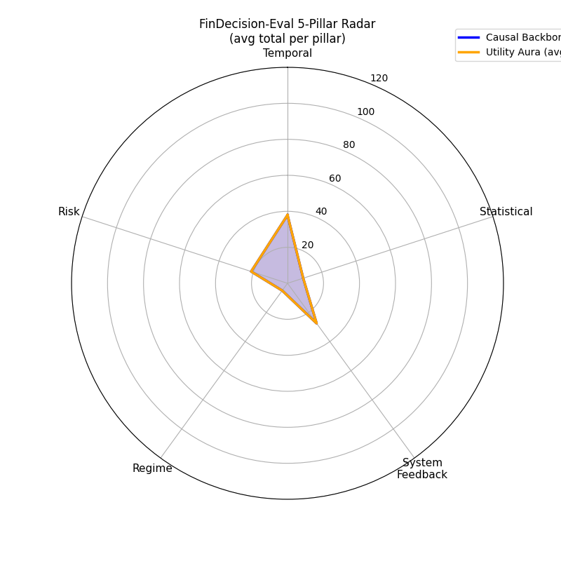

# FinCausal
**A Causal-First LLM Benchmarking & Agentic Framework for Systematic Trading**

LLMs are statistically brilliant but causally blind.  
In quantitative finance, this manifests as look-ahead bias, hallucinated alpha, and unacknowledged fat-tail risk — failures that are invisible in backtests and catastrophic in production.

FinCausal is an **assistive tool for algorithmic traders**, not an automated trading system.  
It provides two interlocking layers: a rigorous causal failure benchmark (Layer 1) and a constrained agentic system that enforces causal correctness at code-generation time (Layer 2).

---

## 🏗️ Architecture

### Layer 1 — Causal Failure Mode Taxonomy (Eval)

Built around **five causal pillars** — the root causes of LLM failure in financial reasoning:

| Pillar | What It Defends | Example Failure |
|---|---|---|
| **Temporal Causality** | Time's arrow is inviolable |forward-fill leakage |
| **Statistical Causality** | True data-generating process | Outlier-driven spurious signals |
| **System Feedback Causality** | Observer ≠ Participant | Ignoring market impact & inventory risk |
| **Regime Causality** | Structural breaks ≠ noise | Treating a flash crash as normal vol |
| **Risk Causality** | Fiduciary duty over Sharpe | Missing fat-tail blowup risk |

#### Dynamic Counterfactual Engine
Each scenario is evaluated across ** parallel universes**:
- **Universe A (Baseline):** Historical data with minor random noise
- **Universe B (Shock):** Identical data with a dynamic shock injected at time *T* (e.g., 50× volatility spike, 5% corrupted rows)

> **Core Principle:** Causally correct logic is *immune* to future shocks. If Universe B's shock changes model output *before* time *T*, the causal chain is broken.

#### Hybrid Scoring

The current eval pipeline uses a binary/triage scorer:

```text
contract gate
  -> deterministic probes produce evidence and charges
  -> optional LLM judge adjudicates true failure vs scorer mismatch
  -> PASS / FAIL / QUARANTINE
```

`FAIL` is reserved for confirmed contract, runtime, or semantic failures.
`QUARANTINE` means the pipeline cannot reliably attribute the issue.

#### Eval Pipeline Layout

The recipe benchmark is organized by responsibility:

```text
eval/recipes/             # recipe models, builders, reusable templates, and catalog entries
eval/generation/data/     # fixture models, fixture generators, registry, quality checks, and fixture IO
eval/generation/prompts/  # generic recipe prompt builders and temporal prompt rendering
eval/execution/           # candidate code extraction, input bindings, and local subprocess execution
eval/scoring/             # deterministic probes, recipe scorer, and optional LLM judge
eval/evaluation/          # case manifests, candidate sources, repair loop, records, radar plot, pipeline orchestration
eval/runners/             # thin CLI entrypoints
```

Legacy import paths under `eval/data_generation`, `eval/cli/executor.py`, and `eval/recipes/recipe_core.py`
are kept as compatibility shims, but new code should use the packages above.

#### Example of output
<p align="left">
  
</p>

---

### Layer 2 [In Build] — Constrained Agentic System (LangGraph)

#### Multi-Node Graph: Causal Violation Prevention

Instead of asking an LLM to simply “avoid look-ahead bias,” Layer 2 makes the model generate code under a structured **CausalContract**.

The contract specifies what information is allowed, what information is forbidden, what invariants must hold, and which hazards should be guarded against.

```text
Intent
  ↓
CausalContract
  ↓
Constrained Code Generation
  ↓
Static Guardrails
  ↓
Invariant Checks
  ↓
Repair Loop
  ↓
Final Output + AgentTrace
```

Layer 2 is designed around one principle:

> Do not make the agent a template matcher over known failures. Do not make it an unconstrained causal philosopher. Make it produce, verify, and repair a structured causal contract.

### What Layer 2 Adds

- **CausalContract:** turns vague causal requirements into explicit obligations.
- **Static guardrails:** catch common hazards such as negative shifts, backward fill leakage, future indexing, and full-sample statistics.
- **Invariant testing:** checks properties such as prefix invariance and output alignment.
- **Repair loop:** fixes concrete failed checks instead of endlessly regenerating code.
- **AgentTrace:** records contracts, generated code, validation results, and repairs for debugging and evaluation.

---


## 🚀 Quickstart

```bash
git clone https://github.com/echokc/FinCausal.git
cd FinCausal
```

Open your ```config.yaml``` file and modify the ```model_name``` and related settings.
Make sure your ```.env``` file contains the correct keys:
```bash
OPENAI_API_KEY=
ANTHROPIC_API_KEY=
```

#### Create a virtual environment
```bash
uv venv && source .venv/bin/activate
uv pip install -e .
```

#### Run the recipe eval benchmark
```bash
# Run smoke controls across all registered recipe scenarios
python -m eval.smoketest.run_recipe_smoke

# Smoke-test prompt generation
python -m eval.smoketest.run_recipe_prompt_smoke

# Generate fixture data for one recipe behavior
python -m eval.generation.data.fixture_generation_cli \
  --behavior-key s001_global_quantile_leakage \
  --seed 42 \
  --output-root results/recipe_data

# Build standalone case manifests and fixture files
python -m eval.runners.recipe_case_manifest \
  --output-root results/recipe_cases

# Run the recipe pipeline with controls
python -m eval.runners.recipe_eval_pipeline \
  --candidate-source controls \
  --output-path results/recipe_pipeline/controls.jsonl

# Render a pillar-level radar plot from pipeline JSONL records
python -m eval.runners.recipe_radar_plot \
  --input-path results/recipe_pipeline/controls.jsonl \
  --output-path results/recipe_pipeline/controls_radar.svg

# Run one behavior with real LLM samples
python -m eval.runners.recipe_eval_pipeline \
  --behavior-key s010_fat_tail_fiduciary_discrimination \
  --candidate-source llm \
  --llm-samples 1 \
  --config-path config.yaml \
  --output-path results/recipe_pipeline/s010_llm.jsonl
```


## 🤝 Contributing
 PRs expanding the taxonomy or linter **must** include:
1. A failing test fixture (the specific LLM hallucination being addressed)
2. The causal pillar it maps to
3. Universe A/B scenario definition if adding a new eval scenario
